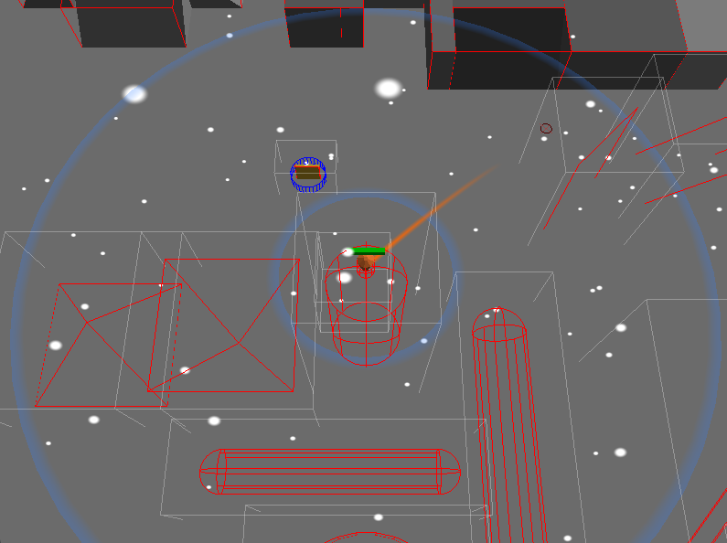
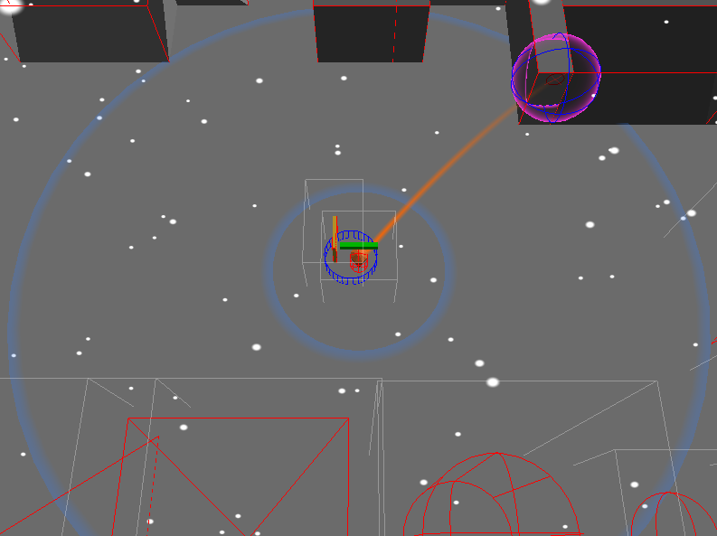
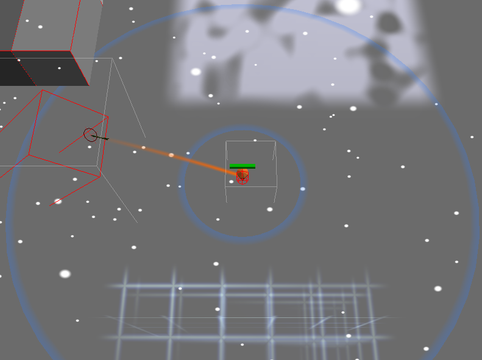

# RPG

Un piccolo motore di gioco 3D scritto in **C++20** e **OpenGL**, con architettura a componenti (ECS), fisica e rilevamento delle collisioni. Il protagonista è una carota animata che si muove in un livello con ostacoli, scale, porte e proiettili.

## Caratteristiche

- Rendering real-time con **OpenGL** (caricamento via GLAD, finestra/input via GLFW)
- Architettura **Entity-Component-System** ([src/ECS.cpp](src/ECS.cpp))
- Fisica e collisioni: corpi dinamici, oggetti statici, scale, proiettili ([src/Collision.cpp](src/Collision.cpp))
- Modelli **`.obj`** caricati a runtime con tinyobjloader ([assets/](assets))
- Animazioni a frame (sequenze di mesh) per gli stati *idle* e *moving*
- Profiling integrato con **Remotery**

## Build

Dipendenze incluse nel repo (`external/`): GLAD, GLFW, GLM, tinyobjloader, Remotery.

```bash
cmake -B build -S .
cmake --build build --config Release
```

L'eseguibile `RPG` viene generato nella cartella `build/`. I percorsi di shader e asset
sono definiti a compile-time (`SHADER_PATH`, `ASSET_PATH`) verso le cartelle del progetto.

## Struttura

| Cartella | Contenuto |
|---|---|
| `src/` | Codice sorgente (rendering, ECS, fisica, input) |
| `include/` | Header del progetto |
| `shaders/` | Shader GLSL |
| `assets/` | Modelli `.obj` e texture |
| `external/` | Librerie di terze parti (vendored) |

## Screenshot

<p align="center">
  
  
  
</p>
